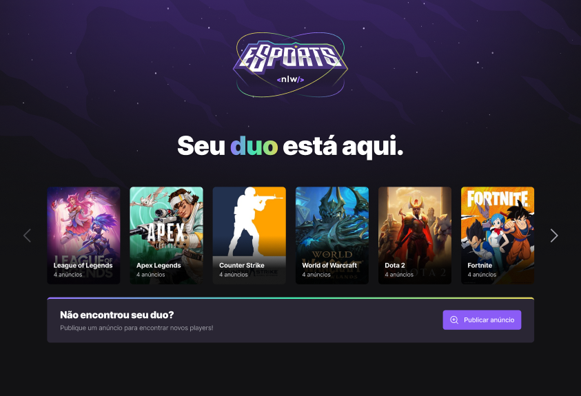

<h1 align="center">
    
</h1>

<h4 align="center"> 
  🚀 Aplicação desenvolvida durante a NLW ESports da Rocketseat 🚀
</h4>

  
  
  
  
  

<h1 align="center">
    
</h1>

## :rocket: Tecnologias

Este projeto foi desenvolvido com as seguintes tecnologias:

- [Node.js](https://nodejs.org/en/) 
- [React](https://reactjs.org)
- [React Native](https://facebook.github.io/react-native/)
- [Expo](https://expo.io/)
- [VITE](https://vitejs.dev/)
- [TAILWINDCSS](https://tailwindcss.com/)
- [PHOSPHOR ICONS](https://phosphoricons.com/)

## :memo: Licença

Este projeto está licenciado sob [MIT](LICENSE).
